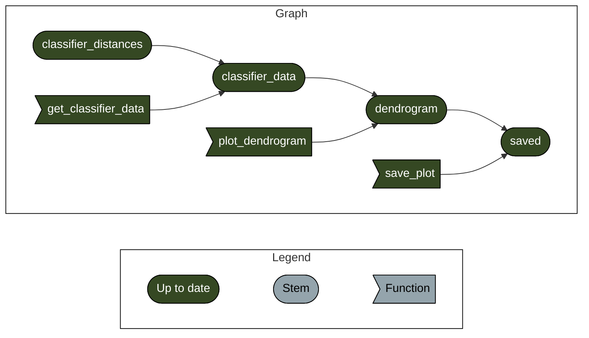

# Code to run the OceanOmics classifier comparison scripts and figures

Launch analysis (RStudio): [](https://mybinder.org/v2/gh/Hobbeist/reproducibility-template-R/HEAD?urlpath=rstudio)  
  
  
[](https://www.docker.com/) [](https://sylabs.io/docs/)

## Analysis
This repository contains all data and code to generate the figures and statistics for the analysis `XXXX`. Simply click on the above `binder` button to launch either a Rstudio or Jupyter notebook session in the browser, with access 
to all code and data in this GitHub repository. There, the code can interactively be changed and different plots and statistics can be (re-)created.

### What is binder?
For an overview of what binder is, please check out [this link](https://mybinder.org/).  

## Where does the data in this repo come from?

TODO 

# Documentation: Add documentation on any data created from raw files here

TODO

## How to run this

The entire analysis is based on R targets. Check out the repo, run `targets::tar_make()`, it should rerun the entire analysis and make all figures.

(regenerate the following using `cat('```mermaid', tar_mermaid(), '```', sep='\n')`)

