# OceanOmics classifier comparison scripts

Launch analysis (RStudio): [](https://mybinder.org/v2/gh/PhilippBayer/OceanOmics-classifier-comparison/HEAD?urlpath=rstudio)  

[](https://www.docker.com/) [](https://sylabs.io/docs/)

## Analysis
This repository contains all data and code to generate the figures and statistics for the OceanOmics taxonomic classifier comparison study. Simply click on the above `binder` button to launch either a Rstudio or Jupyter notebook session in the browser, with access to all code and data in this GitHub repository. There, the code can interactively be changed and different plots and statistics can be (re-)created. The entire analysis is based on R targets which keeps track of all data objects which ensures full reproducibility.

### What is binder?
For an overview of what binder is, please check out [this link](https://mybinder.org/).  

### What is targets?
For an overview of what targets is, please check out [this link](https://books.ropensci.org/targets/walkthrough.html).

## Where does the data in this repo come from?

This data is based on parsing the output of several classifiers. The code for that is in the `parsing/` folder.

## How to run this

Check out the repo, run `targets::tar_make()`, it should rerun the entire analysis and make all figures.

(regenerate the following using `cat('```mermaid', targets::tar_mermaid(), '```', sep='\n')`)

```mermaid
graph LR
  style Legend fill:#FFFFFF00,stroke:#000000;
  style Graph fill:#FFFFFF00,stroke:#000000;
  subgraph Legend
    direction LR
    x7420bd9270f8d27d([""Up to date""]):::uptodate --- x70a5fa6bea6f298d[""Pattern""]:::none
    x70a5fa6bea6f298d[""Pattern""]:::none --- xbf4603d6c2c2ad6b([""Stem""]):::none
    xbf4603d6c2c2ad6b([""Stem""]):::none --- xf0bce276fe2b9d3e>""Function""]:::none
  end
  subgraph Graph
    direction LR
    x21ec04b3aba1a739>"precision"]:::uptodate --> xcd3647a431ed3d93>"make_mean_median_f1_table"]:::uptodate
    x8f227df403c8969f>"accuracy"]:::uptodate --> xcd3647a431ed3d93>"make_mean_median_f1_table"]:::uptodate
    x5bd3c0b98612ad82>"f0.5"]:::uptodate --> xcd3647a431ed3d93>"make_mean_median_f1_table"]:::uptodate
    xdfc9ff1b391aa400>"f1"]:::uptodate --> xcd3647a431ed3d93>"make_mean_median_f1_table"]:::uptodate
    x47d805de93d2f724>"recall"]:::uptodate --> xcd3647a431ed3d93>"make_mean_median_f1_table"]:::uptodate
    x837f996ab35491da>"get_hits_data"]:::uptodate --> x42612793169637e0(["nbc_hits_data"]):::uptodate
    x5117ea88dbd5add2(["nbc_hits"]):::uptodate --> x42612793169637e0(["nbc_hits_data"]):::uptodate
    x92e63fc22641faa5(["merged_all_results"]):::uptodate --> xb55a8ff957ab9650(["final_outcomes_rottnest"]):::uptodate
    xbdd42ceae2a54d2c(["truth_set_data"]):::uptodate --> xb55a8ff957ab9650(["final_outcomes_rottnest"]):::uptodate
    x42612793169637e0(["nbc_hits_data"]):::uptodate --> x25ebbc9fc53b1418(["thirty_subsampled_nbc_hits_data"]):::uptodate
    x476c8f557e2b0910>"subsample_nbc_hits_thirty"]:::uptodate --> x25ebbc9fc53b1418(["thirty_subsampled_nbc_hits_data"]):::uptodate
    x5f73e2549f58db1c(["correctness_table"]):::uptodate --> x6b25831f1b56a7e8(["big_species_table"]):::uptodate
    xbb97e5fbae12b8d4>"make_big_table"]:::uptodate --> x6b25831f1b56a7e8(["big_species_table"]):::uptodate
    x9024d58abea360f6(["kraken_hits_data"]):::uptodate --> xc4269aa5995e6a3f(["subsambled_kraken_hits_data"]):::uptodate
    xa731a5475c946be2>"subsample_blast_hits"]:::uptodate --> xc4269aa5995e6a3f(["subsambled_kraken_hits_data"]):::uptodate
    x70622bc5282148b6(["median_f1_table"]):::uptodate --> xa9d595dde94cca52(["saved_median_f1_table"]):::uptodate
    x7c6dfc5f483b8518>"my_save_table"]:::uptodate --> xa9d595dde94cca52(["saved_median_f1_table"]):::uptodate
    x4cbe0500373226c1(["classifier_data"]):::uptodate --> x264c7e682ec442b2(["dendrogram"]):::uptodate
    x994946b41121bfa6>"plot_dendrogram"]:::uptodate --> x264c7e682ec442b2(["dendrogram"]):::uptodate
    xf2c68c9c4c5bbbc3(["classifier_distances"]):::uptodate --> x4cbe0500373226c1(["classifier_data"]):::uptodate
    x8279777903f3f13d>"get_classifier_data"]:::uptodate --> x4cbe0500373226c1(["classifier_data"]):::uptodate
    x0fe0b162e5f2d977(["counted_correctness"]):::uptodate --> x8c50ad78daae7d7d(["correctness_figure"]):::uptodate
    x5071aff9d46fc375>"plot_correctness"]:::uptodate --> x8c50ad78daae7d7d(["correctness_figure"]):::uptodate
    xa63f30966279f049["all_results"]:::uptodate --> x92e63fc22641faa5(["merged_all_results"]):::uptodate
    x837f996ab35491da>"get_hits_data"]:::uptodate --> x92e63fc22641faa5(["merged_all_results"]):::uptodate
    x544a22aeaed1b2e4>"get_truth_data"]:::uptodate --> xbdd42ceae2a54d2c(["truth_set_data"]):::uptodate
    x70199d3b1152e374(["truth_set"]):::uptodate --> xbdd42ceae2a54d2c(["truth_set_data"]):::uptodate
    xe9d8f2de59f79fa1(["blast_hits_data"]):::uptodate --> xf80ecf3117225a62(["thirty_subsambled_blast_hits_data"]):::uptodate
    x1f8a2aa3facf1873>"subsample_blast_thirty_hits"]:::uptodate --> xf80ecf3117225a62(["thirty_subsambled_blast_hits_data"]):::uptodate
    x837f996ab35491da>"get_hits_data"]:::uptodate --> x9024d58abea360f6(["kraken_hits_data"]):::uptodate
    xc4cff7b61e825181(["kraken_hits"]):::uptodate --> x9024d58abea360f6(["kraken_hits_data"]):::uptodate
    x5f73e2549f58db1c(["correctness_table"]):::uptodate --> x0fe0b162e5f2d977(["counted_correctness"]):::uptodate
    x057c70bd2d39499f>"count_correctness"]:::uptodate --> x0fe0b162e5f2d977(["counted_correctness"]):::uptodate
    x92e63fc22641faa5(["merged_all_results"]):::uptodate --> x4c3c668f02e94ea5(["final_outcomes_100"]):::uptodate
    xbdd42ceae2a54d2c(["truth_set_data"]):::uptodate --> x4c3c668f02e94ea5(["final_outcomes_100"]):::uptodate
    x92e63fc22641faa5(["merged_all_results"]):::uptodate --> xf37c16a7303abc16(["final_outcomes_negative_bacteria"]):::uptodate
    xbdd42ceae2a54d2c(["truth_set_data"]):::uptodate --> xf37c16a7303abc16(["final_outcomes_negative_bacteria"]):::uptodate
    x4c833e115353960c(["error_types_table"]):::uptodate --> xca66a2548aec4c6b(["error_types_figure"]):::uptodate
    x5b31c06096fd55a4>"make_error_types_figure"]:::uptodate --> xca66a2548aec4c6b(["error_types_figure"]):::uptodate
    x7477a20106b865a4(["subsambled_blast_hits_data"]):::uptodate --> xc7b5a37005176fd4(["truth_set_investigation"]):::uptodate
    xc4269aa5995e6a3f(["subsambled_kraken_hits_data"]):::uptodate --> xc7b5a37005176fd4(["truth_set_investigation"]):::uptodate
    xcc0ae95627a4c782(["subsampled_nbc_hits_data"]):::uptodate --> xc7b5a37005176fd4(["truth_set_investigation"]):::uptodate
    xf80ecf3117225a62(["thirty_subsambled_blast_hits_data"]):::uptodate --> xc7b5a37005176fd4(["truth_set_investigation"]):::uptodate
    x9f533bb9ed6cc0bf(["thirty_subsampled_kraken_hits_data"]):::uptodate --> xc7b5a37005176fd4(["truth_set_investigation"]):::uptodate
    x25ebbc9fc53b1418(["thirty_subsampled_nbc_hits_data"]):::uptodate --> xc7b5a37005176fd4(["truth_set_investigation"]):::uptodate
    xbdd42ceae2a54d2c(["truth_set_data"]):::uptodate --> xc7b5a37005176fd4(["truth_set_investigation"]):::uptodate
    x5f73e2549f58db1c(["correctness_table"]):::uptodate --> x70622bc5282148b6(["median_f1_table"]):::uptodate
    xcd3647a431ed3d93>"make_mean_median_f1_table"]:::uptodate --> x70622bc5282148b6(["median_f1_table"]):::uptodate
    x8c50ad78daae7d7d(["correctness_figure"]):::uptodate --> x962124a214cc566f(["save_correct"]):::uptodate
    x063d54dad6ed438a>"my_save_plot"]:::uptodate --> x962124a214cc566f(["save_correct"]):::uptodate
    x62f627c2bcc7f4a3>"assess_correctness"]:::uptodate --> x5f73e2549f58db1c(["correctness_table"]):::uptodate
    x92e63fc22641faa5(["merged_all_results"]):::uptodate --> x5f73e2549f58db1c(["correctness_table"]):::uptodate
    xbdd42ceae2a54d2c(["truth_set_data"]):::uptodate --> x5f73e2549f58db1c(["correctness_table"]):::uptodate
    x9024d58abea360f6(["kraken_hits_data"]):::uptodate --> x9f533bb9ed6cc0bf(["thirty_subsampled_kraken_hits_data"]):::uptodate
    x1f8a2aa3facf1873>"subsample_blast_thirty_hits"]:::uptodate --> x9f533bb9ed6cc0bf(["thirty_subsampled_kraken_hits_data"]):::uptodate
    x4c833e115353960c(["error_types_table"]):::uptodate --> xcc0a806ae560c099(["saved_error_types"]):::uptodate
    x7c6dfc5f483b8518>"my_save_table"]:::uptodate --> xcc0a806ae560c099(["saved_error_types"]):::uptodate
    xe9d8f2de59f79fa1(["blast_hits_data"]):::uptodate --> x7477a20106b865a4(["subsambled_blast_hits_data"]):::uptodate
    xa731a5475c946be2>"subsample_blast_hits"]:::uptodate --> x7477a20106b865a4(["subsambled_blast_hits_data"]):::uptodate
    xca66a2548aec4c6b(["error_types_figure"]):::uptodate --> x10a7fb6eb6bfb12a(["saved_errors"]):::uptodate
    x063d54dad6ed438a>"my_save_plot"]:::uptodate --> x10a7fb6eb6bfb12a(["saved_errors"]):::uptodate
    x2ff9bf2efd8ea8fa(["all_results_files"]):::uptodate --> xa63f30966279f049["all_results"]:::uptodate
    x264c7e682ec442b2(["dendrogram"]):::uptodate --> xaf4a1b2829040c15(["saved"]):::uptodate
    x063d54dad6ed438a>"my_save_plot"]:::uptodate --> xaf4a1b2829040c15(["saved"]):::uptodate
    x42612793169637e0(["nbc_hits_data"]):::uptodate --> xcc0ae95627a4c782(["subsampled_nbc_hits_data"]):::uptodate
    x7cb45ddc20e499f4>"subsample_nbc_hits"]:::uptodate --> xcc0ae95627a4c782(["subsampled_nbc_hits_data"]):::uptodate
    x5f73e2549f58db1c(["correctness_table"]):::uptodate --> x4c833e115353960c(["error_types_table"]):::uptodate
    xb05f917768a3a00b>"make_error_types_table"]:::uptodate --> x4c833e115353960c(["error_types_table"]):::uptodate
    xc65a25d9d96e8f7c(["blast_hits"]):::uptodate --> xe9d8f2de59f79fa1(["blast_hits_data"]):::uptodate
    x837f996ab35491da>"get_hits_data"]:::uptodate --> xe9d8f2de59f79fa1(["blast_hits_data"]):::uptodate
    x0fe0b162e5f2d977(["counted_correctness"]):::uptodate --> x378df8f1e0d25e26(["save_correct_table"]):::uptodate
    x7c6dfc5f483b8518>"my_save_table"]:::uptodate --> x378df8f1e0d25e26(["save_correct_table"]):::uptodate
    x801b32f234e20cdc(["classifier_complexity"]):::uptodate --> x801b32f234e20cdc(["classifier_complexity"]):::uptodate
    xe40955de534d0cf1(["plot_asvs_per_dataset"]):::uptodate --> xe40955de534d0cf1(["plot_asvs_per_dataset"]):::uptodate
    xbf5ac67708da2696(["plot_report"]):::uptodate --> xbf5ac67708da2696(["plot_report"]):::uptodate
    xae01b2c9af307a4d>"get_stats_on_correctness"]:::uptodate --> xae01b2c9af307a4d>"get_stats_on_correctness"]:::uptodate
  end
  classDef uptodate stroke:#000000,color:#ffffff,fill:#354823;
  classDef none stroke:#000000,color:#000000,fill:#94a4ac;
  linkStyle 0 stroke-width:0px;
  linkStyle 1 stroke-width:0px;
  linkStyle 2 stroke-width:0px;
  linkStyle 75 stroke-width:0px;
  linkStyle 76 stroke-width:0px;
  linkStyle 77 stroke-width:0px;
  linkStyle 78 stroke-width:0px;
```
